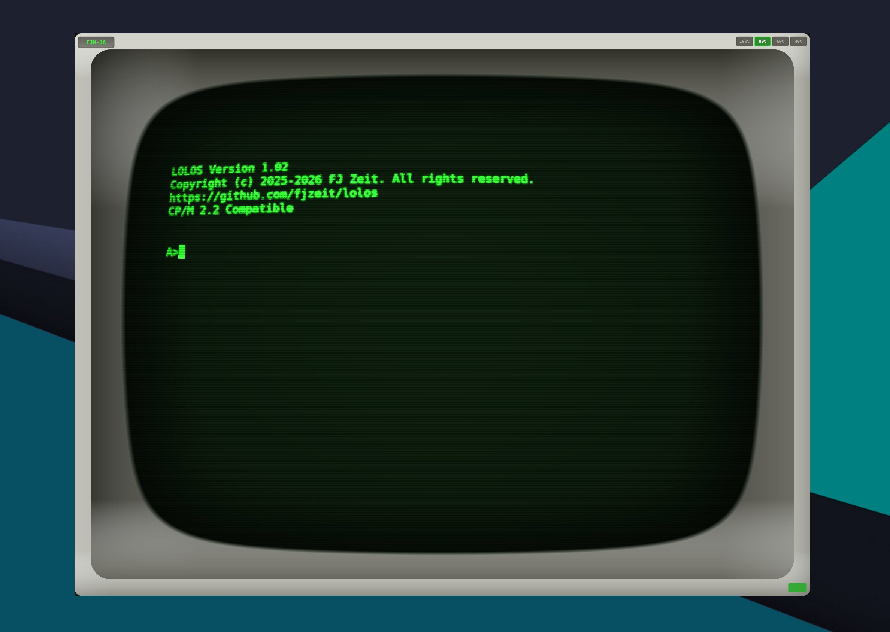

# heh8080

Cross-platform Intel 8080 / Zilog Z80 CPU emulator designed to run LOLOS (a CP/M 2.2 compatible OS) and legacy Z80 software.



## Features

- **Dual CPU support**: Intel 8080 and Zilog Z80
- **CP/M compatible I/O**: Console, FDC, MMU, printer, auxiliary, timer
- **Retro CRT terminal**: Authentic 1970s aesthetic with barrel distortion, bloom, scanlines, and vignette
- **Cross-platform**: Windows, Mac, Linux (NativeAOT), Web (WASM)
- **Responsive scaling**: 100%, 80%, 60%, 40% with platform-aware defaults

## Technology

- .NET 10, Avalonia UI 11.x
- NativeAOT for desktop (19MB native binary)
- WebAssembly for browser
- MIT licensed

## Project Structure

```
src/
  Heh8080.Core/      # Cpu8080, CpuZ80, memory, I/O bus
  Heh8080.Devices/   # FDC, console, MMU, printer, auxiliary, timer
  Heh8080.Terminal/  # FJM-3A terminal emulator
  Heh8080.App/       # Shared UI library: ViewModels, Views, Controls
  Heh8080.Mcp/       # MCP server for AI-assisted development
  Heh8080.Desktop/   # Desktop entry point with Avalonia UI
  Heh8080.Browser/   # Browser entry point with Avalonia WASM
tests/
  Heh8080.Tests/     # Unit and integration tests
  cpu_tests/         # External CPU test suites
```

## Building

```bash
# Desktop (NativeAOT)
dotnet publish src/Heh8080.Desktop -c Release

# Browser (WASM)
dotnet publish src/Heh8080.Browser -c Release
```

## Related Projects

- **LOLOS**: https://github.com/fjzeit/lolos - CP/M 2.2 compatible OS in pure 8080 assembly

## License

MIT
