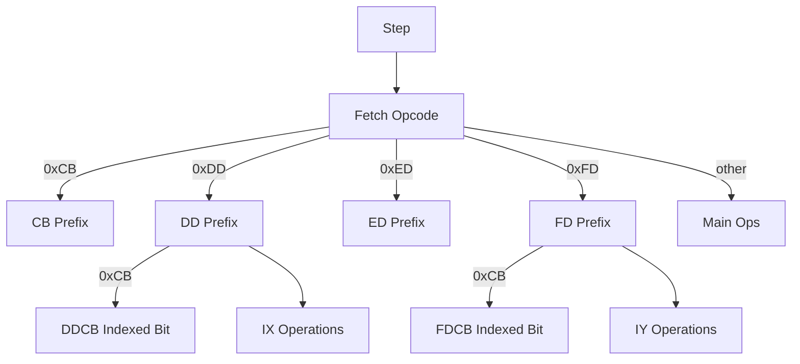

# Z80 CPU Implementation

## Overview

`CpuZ80` in `src/Heh8080.Core/CpuZ80.cs` implements the full Zilog Z80 instruction set, backward-compatible with Intel 8080.

## Architecture



## Registers

### Main Set (8080-compatible)
```
8-bit: A, B, C, D, E, H, L
16-bit pairs: BC, DE, HL, AF (PSW)
```

### Z80 Additions
```
Index: IX, IY (16-bit)
Alternate: A', F', B', C', D', E', H', L'
System: I (interrupt vector), R (refresh counter)
```

### Flags
| Bit | Name | Description |
|-----|------|-------------|
| 7 | S | Sign |
| 6 | Z | Zero |
| 5 | Y | Undocumented (copy of bit 5) |
| 4 | H | Half-carry |
| 3 | X | Undocumented (copy of bit 3) |
| 2 | PV | Parity/Overflow |
| 1 | N | Add/Subtract |
| 0 | C | Carry |

## Instruction Prefixes

| Prefix | Purpose | Example |
|--------|---------|---------|
| CB | Bit operations | `CB 47` = BIT 0,A |
| DD | IX operations | `DD 21 nn nn` = LD IX,nn |
| ED | Extended ops | `ED B0` = LDIR |
| FD | IY operations | `FD 21 nn nn` = LD IY,nn |
| DD CB | Indexed bit ops | `DD CB dd 46` = BIT 0,(IX+d) |
| FD CB | Indexed bit ops | `FD CB dd 46` = BIT 0,(IY+d) |

## Dispatch Tables

```csharp
private readonly Func<int>[] _mainOps;   // 256 main opcodes
private readonly Func<int>[] _cbOps;     // 256 bit operations
private readonly Func<int>[] _edOps;     // Extended operations
private readonly Func<int>?[] _ddOps;    // IX operations (null = fallback)
private readonly Func<int>?[] _fdOps;    // IY operations (null = fallback)
```

## Key Differences from 8080

### New Instructions
- **Relative jumps**: JR, DJNZ (compact loops)
- **Block operations**: LDIR, LDDR, CPIR, CPDR, INIR, OTIR
- **Bit manipulation**: BIT, SET, RES
- **Exchange**: EX AF,AF', EXX
- **Index registers**: All HL operations available with IX/IY+displacement

### Flag Differences
- N flag tracks add vs subtract (for DAA)
- Undocumented X/Y flags copy bits 3/5 of results
- PV is overflow for arithmetic, parity for logical

### Interrupt Modes
```csharp
public byte InterruptMode;  // 0, 1, or 2
public bool IFF1, IFF2;     // Interrupt flip-flops
```

| Mode | Behavior |
|------|----------|
| IM 0 | Execute instruction on data bus (8080-compatible) |
| IM 1 | RST 38h |
| IM 2 | Vector table at (I << 8) \| vector |

## Usage

```csharp
// Select Z80 CPU
var emulator = new Emulator(CpuType.ZilogZ80);

// Access Z80-specific features via cast
if (emulator.Cpu is CpuZ80 z80)
{
    z80.IX = 0x4000;
    z80.InterruptMode = 1;
}
```

## Cycle Counts

Z80 timing differs from 8080. Key differences:
- Most instructions: same or +1 cycle
- Block operations: 16/21 cycles (single/repeat)
- Indexed operations: +8 cycles for displacement fetch

## Validation

For Z80 validation, use ZEXDOC/ZEXALL test suites:
- `ZEXDOC.COM` - Documented instruction exerciser
- `ZEXALL.COM` - All instructions including undocumented

## Related Files

- `src/Heh8080.Core/ICpu.cs` - Common CPU interface
- `src/Heh8080.Core/Cpu8080.cs` - 8080 implementation
- `src/Heh8080.Core/Emulator.cs` - CPU type selection via `CpuType` enum
- [cpu.md](cpu.md) - 8080 CPU documentation
