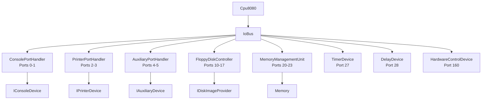

# Device Layer

The device layer in `src/Heh8080.Devices/` implements I/O port handlers for CP/M compatible peripherals.

## Architecture



## Device Interfaces

All port handlers implement `IIoDevice` from Core and register with `IoBus`.

### Console (`IConsoleDevice`)
- `IsInputReady` - Check if keyboard input available
- `ReadChar()` - Read character from keyboard
- `WriteChar(byte)` - Write character to display

### Printer (`IPrinterDevice`)
- `IsReady` - Check if printer ready
- `WriteChar(byte)` - Write character to printer

### Auxiliary (`IAuxiliaryDevice`)
- `IsInputReady`, `IsEof` - Input status
- `ReadByte()`, `WriteByte(byte)` - Data I/O
- `SetEof()` - Signal end of file

### Disk Storage (`IDiskImageProvider`)
- `Mount(drive, path, readOnly)` - Mount disk image
- `Unmount(drive)` - Unmount disk
- `ReadSector(drive, track, sector, buffer)` - Read 128 bytes
- `WriteSector(drive, track, sector, buffer)` - Write 128 bytes

## Port Handlers

### ConsolePortHandler (Ports 0-1)
```csharp
var console = new ConsolePortHandler(consoleDevice);
console.Register(ioBus);
```

### FloppyDiskController (Ports 10-17)
Implements full FDC with DMA transfer to memory.

```csharp
var fdc = new FloppyDiskController(diskProvider, memory);
fdc.Register(ioBus);

// Mount disk image
diskProvider.Mount(0, "disk_a.img");
```

Status codes: OK(0), InvalidDrive(1), InvalidTrack(2), InvalidSector(3), SeekError(4), ReadError(5), WriteError(6), InvalidCommand(7)

### MemoryManagementUnit (Ports 20-23)
Wraps `Memory` class bank switching.

```csharp
var mmu = new MemoryManagementUnit(memory);
mmu.Register(ioBus);
```

### TimerDevice (Port 27)
10ms interrupt timer.

```csharp
var timer = new TimerDevice();
timer.SetInterruptCallback(() => cpu.Interrupt(7));
timer.Register(ioBus);

// Call from emulator loop every 10ms
timer.Tick();
```

### HardwareControlDevice (Port 160)
System control with unlock mechanism.

```csharp
var hw = new HardwareControlDevice();
hw.SetResetCallback(() => /* reset system */);
hw.SetHaltCallback(() => /* halt emulation */);
hw.Register(ioBus);
```

## Platform Implementations

### FileDiskImageProvider (Desktop)
File-based disk I/O for Windows/Mac/Linux.

```csharp
using var provider = new FileDiskImageProvider();
provider.Mount(0, "/path/to/disk_a.img");
provider.Mount(1, "/path/to/disk_b.img", readOnly: true);
```

Disk format: Flat binary, 77 tracks × 26 sectors × 128 bytes = 256KB

### Browser (IndexedDB)
To be implemented in Phase 7 via JS interop.

## Example Setup

```csharp
// Create core components
var memory = new Memory();
var ioBus = new IoBus();
var cpu = new Cpu8080(memory, ioBus);

// Create disk provider
var diskProvider = new FileDiskImageProvider();
diskProvider.Mount(0, "lolos.img");

// Register devices
new ConsolePortHandler(consoleDevice).Register(ioBus);
new PrinterPortHandler().Register(ioBus);
new AuxiliaryPortHandler().Register(ioBus);
new FloppyDiskController(diskProvider, memory).Register(ioBus);
new MemoryManagementUnit(memory).Register(ioBus);
new TimerDevice().Register(ioBus);
new DelayDevice().Register(ioBus);
new HardwareControlDevice().Register(ioBus);
```

## Related Files

- [io-ports.md](io-ports.md) - Port assignment reference
- [../core/cpu.md](../core/cpu.md) - CPU and IoBus interface
