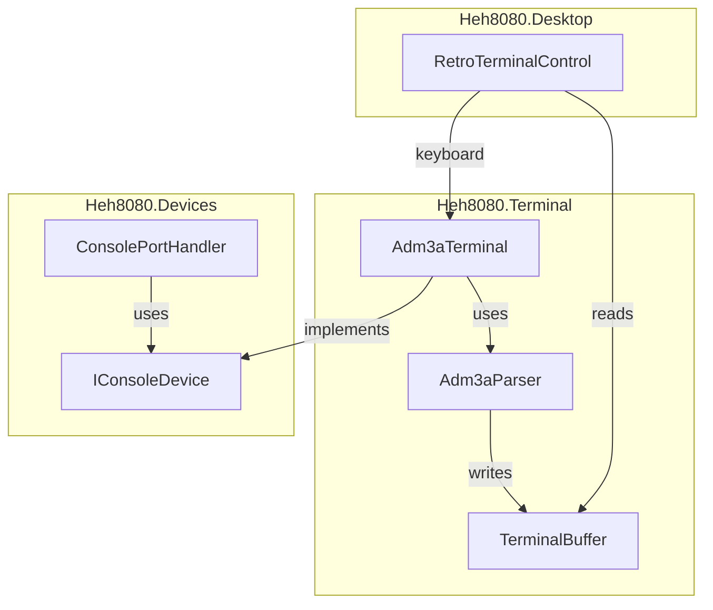

# Terminal Layer

The terminal layer in `src/Heh8080.Terminal/` implements an FJM-3A terminal emulator (ADM-3A compatible escape sequences).

## Architecture



## Components

### TerminalCell
Simple struct holding a character and attributes:
```csharp
public struct TerminalCell
{
    public char Character;
    public bool Inverse;
    public readonly bool IsEmpty => Character == '\0' || Character == ' ';
}
```

### TerminalBuffer (80×24)
Fixed-size character grid with cursor tracking:
- `Clear()` - Clear entire buffer
- `ClearToEndOfLine()` / `ClearToEndOfScreen()` - Partial clear
- `WriteChar(char)` - Write at cursor, advance cursor
- `ScrollUp()` - Scroll content up, clear bottom line
- `ContentChanged` event for UI refresh

### Adm3aParser
State machine for ADM-3A escape sequences:

| State | On Input | Action |
|-------|----------|--------|
| Normal | ESC (0x1B) | → Escape state |
| Normal | Printable | Write to buffer |
| Normal | Control | Execute (CR, LF, BS, etc.) |
| Escape | `=` | → CursorRow state |
| Escape | `T` | Clear to EOL, → Normal |
| Escape | `Y` | Clear to EOS, → Normal |
| Escape | `*` or `:` | Clear screen, → Normal |
| CursorRow | byte | Store row, → CursorCol |
| CursorCol | byte | Set cursor position, → Normal |

### Adm3aTerminal
Combines buffer + parser, implements `IConsoleDevice`:
```csharp
public class Adm3aTerminal : IConsoleDevice
{
    public bool IsInputReady => _inputQueue.Count > 0;
    public byte ReadChar() => _inputQueue.Dequeue();
    public void WriteChar(byte c) => _parser.ProcessByte(c);

    public void QueueInput(byte c);      // For keyboard
    public void QueueInput(string s);    // For pasting
    public TerminalBuffer Buffer { get; } // For rendering
}
```

## Control Codes

| Code | Hex | Action |
|------|-----|--------|
| Backspace | 0x08 | Cursor left |
| Tab | 0x09 | Next tab stop (8-column) |
| Line Feed | 0x0A | Cursor down, scroll if needed |
| Cursor Up | 0x0B | Cursor up (Ctrl+K) |
| Cursor Right | 0x0C | Cursor right (Ctrl+L) |
| Carriage Return | 0x0D | Cursor to column 0 |
| Clear Screen | 0x1A | Clear + home (Ctrl+Z) |
| Home | 0x1E | Cursor to 0,0 (Ctrl+^) |

## Escape Sequences

| Sequence | Action |
|----------|--------|
| ESC = row col | Set cursor (row/col + 0x20) |
| ESC T | Clear to end of line |
| ESC Y | Clear to end of screen |
| ESC * | Clear screen |
| ESC : | Clear screen (alt) |

## CRT Visual Effects

RetroTerminalControl uses a SkiaSharp SKSL shader for authentic CRT effects:

### Screen Geometry
| Setting | Value |
|---------|-------|
| Aspect Ratio | 4:3 (enforced) |
| Horizontal Padding | 80px (keeps text from curved edges) |
| Bezel Size | 48px |
| Corner Radius | 40px |

### Shader Effects
| Effect | Implementation |
|--------|---------------|
| Background | #0A140A (near-black green) |
| Foreground | #33FF33 (bright green) |
| Barrel Distortion | `1.0 + 0.3*r² + 0.2*r⁴` - curves text at edges |
| Bloom | 8-tap blur adds phosphor glow |
| Scanlines | `fract(y/3) >= 0.5` - 30% darker bands |
| Vignette | `0.5 + 0.5 * (1 - 1.4r²)` - center-to-edge darkening |
| Edge Shadow | 40px smoothstep - housing overlap effect |
| Anti-aliasing | 2px blend at screen boundary |

### Housing Design
Light gray bezel (#B8B8B0) with 3D shading:
- Top/left: subtle highlight
- Bottom/right: subtle shadow
- Screen appears recessed behind housing
- FJM-3A logo button in top-left corner (click opens ConfigDialog)

### Rendering Pipeline
1. Terminal content rendered centered to offscreen `SKSurface`
2. CRT shader applies distortion, bloom, scanlines, vignette, edge shadow
3. Anti-aliased blend at curved screen boundary
4. Result composited with bezel frame

### SKSL Shader Notes
- Use `sample(shader, coords)` not `shader.eval(coords)`
- `smoothstep` not available - use manual: `t*t*(3-2t)`
- Child shaders declared as `uniform shader name`
- Coordinates in pixels, not normalized

## Keyboard Mapping

Input is filtered to ADM-3A compatible characters only:

**Text Input**: Printable ASCII only (0x20-0x7E)

**Special Keys**:
```csharp
Key.Return => 0x0D
Key.Back => 0x08
Key.Delete => 0x7F
Key.Escape => 0x1B
Key.Tab => 0x09
Key.Up => 0x0B    // ADM-3A: Ctrl+K
Key.Down => 0x0A  // ADM-3A: Ctrl+J (Line feed)
Key.Left => 0x08  // ADM-3A: Ctrl+H (Backspace)
Key.Right => 0x0C // ADM-3A: Ctrl+L
Ctrl+A..Z => 0x01..0x1A
```

Note: Arrow keys send same codes as Ctrl+H/J/K/L (this is why vi uses hjkl - Bill Joy used an ADM-3A).

## Usage

```csharp
// Create terminal
var terminal = new Adm3aTerminal();

// Wire to ConsolePortHandler
var console = new ConsolePortHandler(terminal);
console.Register(ioBus);

// Wire to UI
terminalControl.Terminal = terminal;

// Keyboard input from UI
terminal.QueueInput((byte)'A');

// CPU output via port 1
cpu.Out(1, 0x48); // 'H' goes to parser → buffer → UI
```

## Related Files

- [../devices/devices.md](../devices/devices.md) - ConsolePortHandler
- [../devices/io-ports.md](../devices/io-ports.md) - Port 0-1 spec
- [../plans/phase5-terminal.md](../plans/phase5-terminal.md) - Implementation plan
