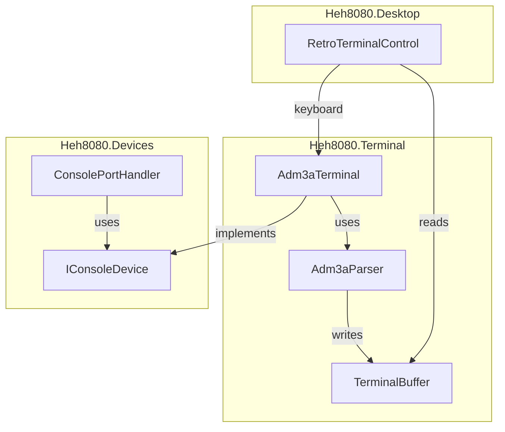

# Terminal Layer

The terminal layer in `src/Heh8080.Terminal/` implements an FJM-3A terminal emulator (ADM-3A compatible escape sequences).

## Architecture



## Components

### TerminalCell
Simple struct holding a character and attributes:
```csharp
public struct TerminalCell
{
    public char Character;
    public bool Inverse;
    public readonly bool IsEmpty => Character == '\0' || Character == ' ';
}
```

### TerminalBuffer (80×24)
Fixed-size character grid with cursor tracking:
- `Clear()` - Clear entire buffer
- `ClearToEndOfLine()` / `ClearToEndOfScreen()` - Partial clear
- `WriteChar(char)` - Write at cursor, advance cursor
- `ScrollUp()` - Scroll content up, clear bottom line
- `ContentChanged` event for UI refresh

### Adm3aParser
State machine for ADM-3A escape sequences:

| State | On Input | Action |
|-------|----------|--------|
| Normal | ESC (0x1B) | → Escape state |
| Normal | Printable | Write to buffer |
| Normal | Control | Execute (CR, LF, BS, etc.) |
| Escape | `=` | → CursorRow state |
| Escape | `T` | Clear to EOL, → Normal |
| Escape | `Y` | Clear to EOS, → Normal |
| Escape | `*` or `:` | Clear screen, → Normal |
| CursorRow | byte | Store row, → CursorCol |
| CursorCol | byte | Set cursor position, → Normal |

### Adm3aTerminal
Combines buffer + parser, implements `IConsoleDevice`:
```csharp
public class Adm3aTerminal : IConsoleDevice
{
    public bool IsInputReady => _inputQueue.Count > 0;
    public byte ReadChar() => _inputQueue.Dequeue();
    public void WriteChar(byte c) => _parser.ProcessByte(c);

    public void QueueInput(byte c);      // For keyboard
    public void QueueInput(string s);    // For pasting
    public TerminalBuffer Buffer { get; } // For rendering
}
```

## Control Codes

| Code | Hex | Action |
|------|-----|--------|
| Backspace | 0x08 | Cursor left |
| Tab | 0x09 | Next tab stop (8-column) |
| Line Feed | 0x0A | Cursor down, scroll if needed |
| Cursor Up | 0x0B | Cursor up (Ctrl+K) |
| Cursor Right | 0x0C | Cursor right (Ctrl+L) |
| Carriage Return | 0x0D | Cursor to column 0 |
| Clear Screen | 0x1A | Clear + home (Ctrl+Z) |
| Home | 0x1E | Cursor to 0,0 (Ctrl+^) |

## Escape Sequences

| Sequence | Action |
|----------|--------|
| ESC = row col | Set cursor (row/col + 0x20) |
| ESC T | Clear to end of line |
| ESC Y | Clear to end of screen |
| ESC * | Clear screen |
| ESC : | Clear screen (alt) |

## CRT Visual Effects

RetroTerminalControl uses a SkiaSharp SKSL shader for authentic 1970s CRT effects.

### Screen Geometry
| Setting | Value | Purpose |
|---------|-------|---------|
| Aspect Ratio | 4:3 | Authentic CRT proportions |
| Horizontal Padding | 120px | Keeps text away from curved edges |
| Vertical Padding | 80px | Calculated from 4:3 ratio |
| Outer Bezel Size | 48px | Light gray housing frame |
| Inner Bezel Size | 12px | Dark frame around CRT glass |
| Housing Corner Radius | 16px | Rounded outer housing |
| Inner Bezel Corner Radius | 44px | Rounded inner frame |
| Screen Corner Radius | 40px | CRT glass rounding |

### CRT Glass Boundary
The screen uses a **superellipse** formula for curved edges like a real CRT tube:
```
curvedDist = pow(pow(x, n) + pow(y, n), 1/n)
```
Where `n=7` gives subtle edge curvature (higher = more rectangular, 2 = ellipse).

Pixels outside the curved boundary return transparent, allowing the inner bezel to show through.

### Shader Effects
| Effect | Implementation |
|--------|---------------|
| Background | #0A140A (near-black green) |
| Foreground | #33FF33 (bright green P1 phosphor) |
| Barrel Distortion | `1.0 + 0.3*r² + 0.2*r⁴` - curves content at edges |
| Bloom | 8-tap blur adds phosphor glow |
| Scanlines | `fract(y/3) >= 0.5` - 30% darker bands |
| Vignette | `0.5 + 0.5 * (1 - 1.4r²)` - center-to-edge darkening |
| Edge Shadow | Smoothstep from 0.7 to 1.0 - darkens near curved boundary |
| Transparency | Superellipse boundary - pixels outside are transparent |

### Housing Design (3-Layer)

```
┌─────────────────────────────────────┐  ← Outer housing (#B8B8B0)
│  ┌───────────────────────────────┐  │     16px corner radius
│  │  ┌─────────────────────────┐  │  │  ← Inner bezel (#505048)
│  │  │                         │  │  │     44px corner radius, 3D shading
│  │  │      CRT Glass          │  │  │  ← Screen content
│  │  │   (curved boundary)     │  │  │     Superellipse n=7
│  │  │                         │  │  │
│  │  └─────────────────────────┘  │  │
│  └───────────────────────────────┘  │
└─────────────────────────────────────┘
```

**Outer Housing** (#B8B8B0 light gray):
- Top/left: subtle highlight gradient
- Bottom/right: subtle shadow gradient
- 16px rounded corners

**Inner Bezel** (#505048 medium gray):
- Top/left: darker shadow (inset depth)
- Bottom/right: lighter highlight
- 44px rounded corners
- Creates recessed frame effect

**FJM-3A Logo**: Button in top-left corner opens ConfigDialog

### Rendering Pipeline
1. Draw outer housing with rounded corners and 3D shading
2. Draw inner bezel with rounded corners and inset shading
3. Render terminal content centered to offscreen `SKSurface`
4. Apply CRT shader (distortion, bloom, scanlines, vignette, edge shadow)
5. Shader returns transparent for pixels outside superellipse boundary
6. Result composited - inner bezel visible at curved corners

### SKSL Shader Notes
- Use `sample(shader, coords)` not `shader.eval(coords)`
- `smoothstep` not available - use manual: `t*t*(3-2t)`
- `pow()` works for superellipse calculation
- Child shaders declared as `uniform shader name`
- Coordinates in pixels, not normalized
- Return `half4(0,0,0,0)` for transparent pixels outside boundary

### Future Enhancement: CRT Refresh Roll

Real CRT monitors display a visible "refresh line" moving down the screen as the electron beam scans. This effect was prototyped but deferred for future implementation.

**Implementation approach:**
1. Add `DispatcherTimer` (~30fps) to trigger redraws
2. Pass elapsed time to shader via `uniform float time`
3. In shader, calculate roll position: `float rollY = fract(time * speed)`
4. Apply brightness boost near roll line:
```glsl
// Sharp horizontal line moving down
float rollPos = fract(time * 0.5);  // speed: 0.5 = 2 seconds per cycle
float distToRoll = abs(uv.y - rollPos);
float rollBrightness = distToRoll < 0.01 ? 1.2 : 1.0;  // thin bright line
color.rgb *= rollBrightness;
```

**Parameters to tune:**
- `speed`: How fast the line moves (0.5 = 2 sec cycle, 1.0 = 1 sec)
- `lineWidth`: Thickness of the bright band (0.01 = very thin)
- `brightness`: Intensity boost (1.1-1.3 range)

**Challenges encountered:**
- Effect was subtle and hard to see against scanlines
- Needed to be a sharp line, not a sine wave
- Direction should be top-to-bottom (subtract time from y, not add)
- May need higher contrast or different blending approach

## Keyboard Mapping

Input is filtered to ADM-3A compatible characters only:

**Text Input**: Printable ASCII only (0x20-0x7E)

**Special Keys**:
```csharp
Key.Return => 0x0D
Key.Back => 0x08
Key.Delete => 0x7F
Key.Escape => 0x1B
Key.Tab => 0x09
Key.Up => 0x0B    // ADM-3A: Ctrl+K
Key.Down => 0x0A  // ADM-3A: Ctrl+J (Line feed)
Key.Left => 0x08  // ADM-3A: Ctrl+H (Backspace)
Key.Right => 0x0C // ADM-3A: Ctrl+L
Ctrl+A..Z => 0x01..0x1A
```

Note: Arrow keys send same codes as Ctrl+H/J/K/L (this is why vi uses hjkl - Bill Joy used an ADM-3A).

## Usage

```csharp
// Create terminal
var terminal = new Adm3aTerminal();

// Wire to ConsolePortHandler
var console = new ConsolePortHandler(terminal);
console.Register(ioBus);

// Wire to UI
terminalControl.Terminal = terminal;

// Keyboard input from UI
terminal.QueueInput((byte)'A');

// CPU output via port 1
cpu.Out(1, 0x48); // 'H' goes to parser → buffer → UI
```

## Related Files

- [../devices/devices.md](../devices/devices.md) - ConsolePortHandler
- [../devices/io-ports.md](../devices/io-ports.md) - Port 0-1 spec
- [../plans/phase5-terminal.md](../plans/phase5-terminal.md) - Implementation plan
