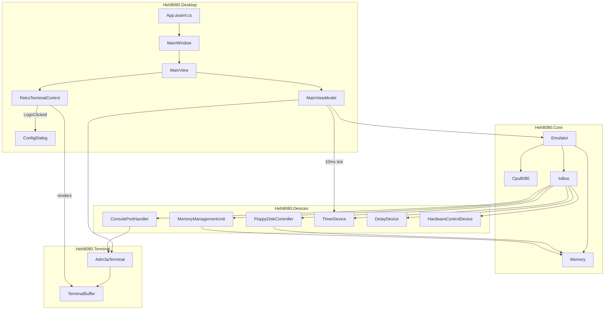

# Desktop Application Architecture

The Avalonia desktop application orchestrates the 8080 emulator with the FJM-3A terminal display.

## Component Diagram



## Key Files

| File | Purpose |
|------|---------|
| `Emulator.cs` | CPU execution loop on background thread |
| `MainViewModel.cs` | Device wiring, auto-boot, commands |
| `MainView.axaml.cs` | Terminal wiring, config dialog trigger |
| `RetroTerminalControl.cs` | CRT shader, FJM-3A logo button |
| `ConfigDialog.axaml` | Disk mount/unmount, reset |

## Threading Model

```
┌─────────────────┐     ┌─────────────────┐
│   UI Thread     │     │  CPU Thread     │
├─────────────────┤     ├─────────────────┤
│ Avalonia render │     │ Cpu.Step() loop │
│ Input handling  │◄────│ ContentChanged  │
│ Dialog display  │────►│ Start/Stop      │
└─────────────────┘     └─────────────────┘
         ▲
         │ Dispatcher.UIThread.Post()
         │
┌─────────────────┐
│  Timer Thread   │
├─────────────────┤
│ 10ms tick       │
│ → TimerDevice   │
│ → Cpu.Interrupt │
└─────────────────┘
```

## Auto-Boot Sequence

1. Extract bundled `lolos.dsk` from embedded resources to temp file
2. Mount to drive A: via `FileDiskImageProvider`
3. Read boot sector (track 0, sector 1, 128 bytes)
4. Load boot sector to memory at 0x0000
5. Set PC=0x0000, SP=0xFFFF
6. Start 10ms interrupt timer
7. Start Emulator (CPU thread)

## Device Registration

All devices implement `Register(IoBus bus)` pattern:

```csharp
_console = new ConsolePortHandler(_terminal);
_console.Register(_emulator.IoBus);           // Ports 0-1

_fdc = new FloppyDiskController(_diskProvider, _emulator.Memory);
_fdc.Register(_emulator.IoBus);               // Ports 10-17

_mmu = new MemoryManagementUnit(_emulator.Memory);
_mmu.Register(_emulator.IoBus);               // Ports 20-23

_timer = new TimerDevice();
_timer.Register(_emulator.IoBus);             // Port 27
_timer.SetInterruptCallback(OnTimerInterrupt);

_delay = new DelayDevice();
_delay.Register(_emulator.IoBus);             // Port 28

_hwControl = new HardwareControlDevice();
_hwControl.Register(_emulator.IoBus);         // Port 160
_hwControl.SetResetCallback(OnResetRequested);
_hwControl.SetHaltCallback(OnHaltRequested);
```

## UI Design

Borderless window with minimal chrome - just the FJM-3A terminal:

- **Borderless**: `SystemDecorations="None"` - no title bar or window controls
- **Drag to move**: Click and drag anywhere (except buttons) to move window
- **Keyboard focus**: All keypresses route to terminal automatically
- **Logo button**: Top-left bezel corner, "FJM-3A" text
- **Scale buttons**: Top-right bezel corner, four buttons (100%, 80%, 60%, 40%)
- **Exit button**: Bottom-right bezel corner, green square (no legend), closes app
- **Click logo**: Opens ConfigDialog modal
- **ConfigDialog**: Disk mount/unmount for A:-D:, Reset button
- No Start/Stop - emulator runs continuously from launch

## Display Scaling

- **Default scale**: 60% (set in `MainWindow.axaml.cs`)
- **Available scales**: 100%, 80%, 60%, 40%
- **Window behavior**: Not user-resizable (`CanResize="False"`), auto-sizes to fit terminal on scale change
- **User control**: Click scale buttons to change; window adjusts automatically
- **Scale buttons**: Rendered in outer bezel, highlight current selection

```csharp
// MainWindow.axaml.cs
MainView.TerminalScale = 0.6;  // Initial 60% scale
MainView.TerminalScaleChanged += OnTerminalScaleChanged;  // Resize window on change
```
